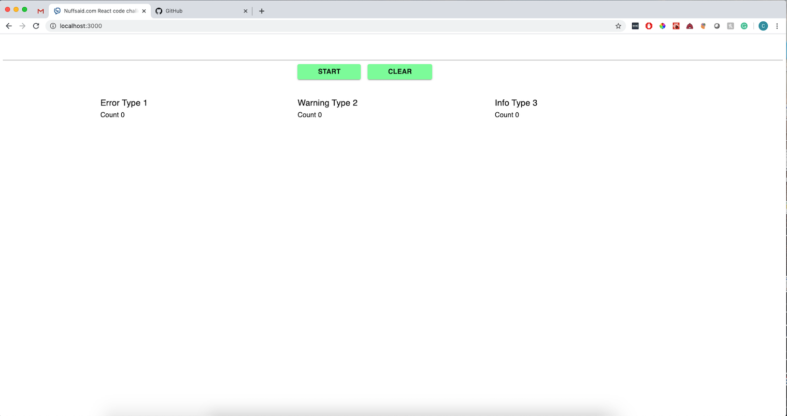

# Nuffsaid Front End Coding Challenge By Chris Krajewski

## Contribution

I've collected a list of [Improvements](#improvements) that need to be done.
If you'd like to help by contributing to the project, you're more than welcome to! 

## Install and run

First clone the repository:

```
git clone https://github.com/ckrajewski/Nuffsaid
```

Open a terminal and cd into the `Nuffsaid` folder. Then:

1. `npm install`
2. `npm start` 

Open a tab in your browser and navigate to `http://localhost:3000` where the website will be running!

## Running Tests

Open a terminal and cd into the `Nuffsaid` folder. Then:

1. `npm test` 

Your terminal will scan through and run the tests in the test directory using Jest

## Looking at the code

To take a close look at the front end code (React) feel free to use any text editor i.e. Sublime/Atom. Here's not the time to argue which is better :) 

## The Acceptance Criteria Checklist
- [x] used React hooks
- [x] wrote some Jest tests using snapshots
- [x] Messages rendered in a table-like structure. The newest messages appear at the top of their respective columns.
- [x] Messages color-coded depending on the priority of the message. see [utils.js](./src/utils.js)
- [x] Each time a message with the priority level of error is received, a snackbar containing the error message appears at the top of the application. The error disappears:
  - in 2 seconds
  - when another error message takes its place
  - when the user clears it via the provided button within in the 
    error message.
- [x] A user can clear all messages at any point.
- [x]  A user can clear a specific message in a specific column
- [x] A user can start and stop incoming messages. The start/stop button updates depending on the state of the feed. The default state is start, with messages coming in
- [x] There is a count of specific messages in each column
- [x] Used Material-UI components and JSS styles.

## Feedback
In case you have any comments, questions, bugs, enhancements feel free to open an issue in this repository.

## Improvements
- [ ] Add better error handling
- [ ] Make more comprehensive tests
- [ ] Add more configurability to components

## Sample Screenshots of Project

### Screen with Messages Coming In


### Cleared State



### Error Message Snack Bar Ontop of Screen


### Screen with No Messages Coming In  (Stopped) 

